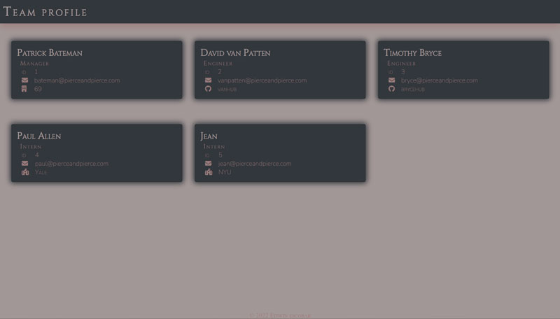
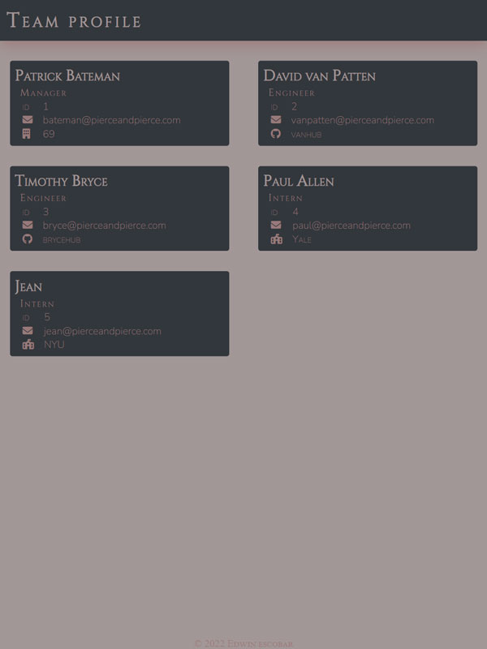
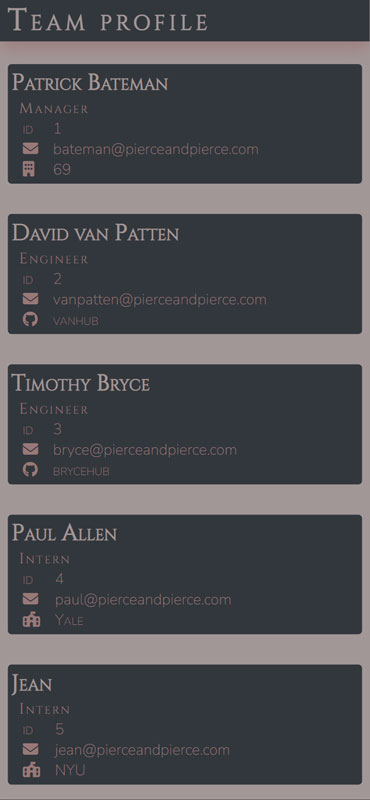

# team-profile-generator

  * [Repo](https://github.com/escowin/team-profile-generator)

  
  
## Description

  answer employee-related prompts in the command line, get a profile page of your company's current team. app built with object-oriented-programming & test-driven-deployment in mind.

## Languages

  CSS, JavaScript, ES6, Node.js

## Table of Contents

  * [Installation](#installation)

  * [Usage](#usage)
  
  * [License](#license)

  * [Contributing](#contributing)

  * [Test](#test)

  * [Screenshots](#screenshots)

  * [Author](#author)

## Installation

  Run the following command to install necessary dependencies:

  ```
  git clone <repo>; npm i; node index
  ```

## Usage

  use by cloning to your local machine


## Contributing

  contributions not needed

## Test
  
  Run the following command to run tests:
  ```
  npm run test <lib/____.js>
  ```

## Screenshots

  
  
  

## Author

  Edwin Escobar

  * [Email](mailto:edwin@escowinart.com)

  * [GitHub](https://github.com/escowin)
